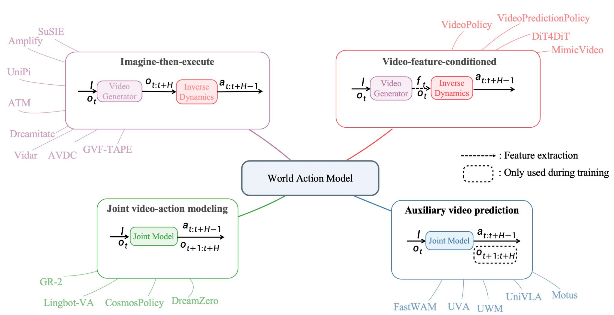

# From World Models to World Action Models: A Concise Tutorial for Robotics

[**Xiaoxiong Zhang**](https://xiaoxiongzzzz.github.io/),
[**Xiong Zeng**](https://zengxiong111.github.io/zengxiong.github.io/), and
[**Wei Zhang**](https://www.wzhanglab.site/)
Southern University of Science and Technology; LimX Dynamics

[Website](https://clearlab-sustech.github.io/WorldModelSurvey/) |
[arXiv](https://arxiv.org/abs/2607.00836) |
[Paper PDF](https://clearlab-sustech.github.io/WorldModelSurvey/assets/Understanding_World_Models__A_Tutorial_Perspective.pdf) |
[Taxonomy](https://clearlab-sustech.github.io/WorldModelSurvey/#design-space) |
[Resource Browser](https://clearlab-sustech.github.io/WorldModelSurvey/#resources) |
[Citation](https://clearlab-sustech.github.io/WorldModelSurvey/#citation)

This survey provides a tutorial-oriented map of world models for embodied
intelligence. We organize existing work by asking three questions: what the
model predicts, where prediction is performed, and how predicted futures can be
connected to executable robot behavior.

## Overview

World models are action-conditioned predictive models of how task-relevant
aspects of the world evolve. Since the world is only partially observable in
many embodied settings, the prediction target can be either a future
observation or a future state representation. This leads to two complementary
formulations:

- **Observation-space world models** directly predict future observations, such
  as RGB images, multi-view RGB, RGB-D frames, or point clouds. We organize this
  family by observation explicitness and action abstraction.
- **State-space world models** first abstract observations into a compact state,
  then model future evolution in that state space. Representative state choices
  include latent states, point tracks, neural-symbolic predicates, and physical
  states.

## World Action Models

Prediction alone is not sufficient for embodied decision making: a robot must
also infer which actions can realize an imagined future. We therefore discuss
**world action models**, which connect visual future prediction with executable
robot actions.

The survey groups world action models into four paradigms:

- **Imagine-then-execute**, where a visual future is generated first and then
  grounded into actions by an inverse dynamics model or goal-conditioned policy.
- **Video-feature-conditioned action prediction**, where intermediate features
  from a video prediction model condition the action model without decoding a
  full future video at inference time.
- **Joint video-action modeling**, where a unified generative model predicts
  both future observations and action sequences.
- **Auxiliary video prediction for policy learning**, where future prediction
  is used as a training objective to shape policy representations.



## Resource Browser

The companion website includes a filterable paper list aligned with the survey
taxonomy. It covers observation-space world models, state-space world models,
world action models, and foundation/video models used by related work.

Browse the list here:  
https://clearlab-sustech.github.io/WorldModelSurvey/#resources

## Citation

```bibtex
@article{zhang2026worldactionmodels,
  title   = {From World Models to World Action Models: A Concise Tutorial for Robotics},
  author  = {Zhang, Xiaoxiong and Zeng, Xiong and Zhang, Wei},
  year    = {2026},
  note    = {Survey manuscript}
}
```

## Contact

Suggestions, taxonomy improvements, missing papers, and discussion are welcome:

```text
12433017@mail.sustech.edu.cn
```
