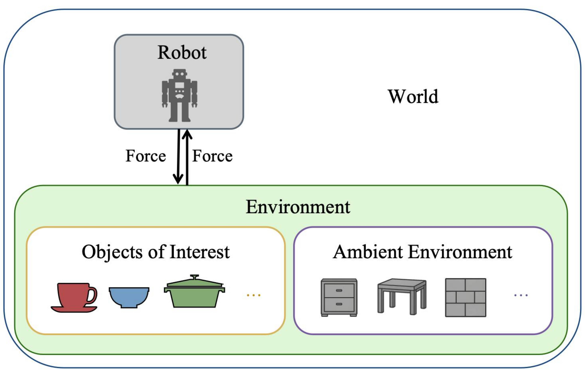
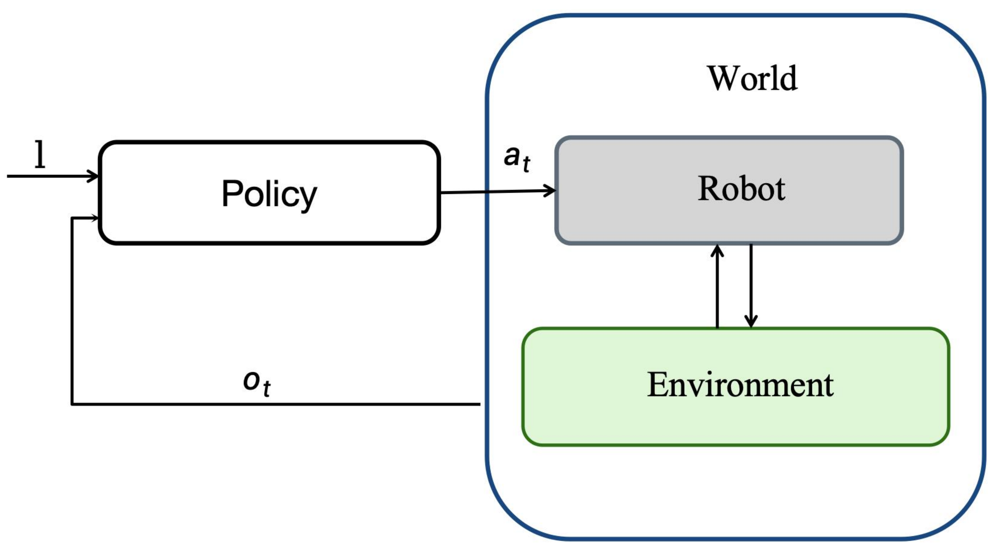
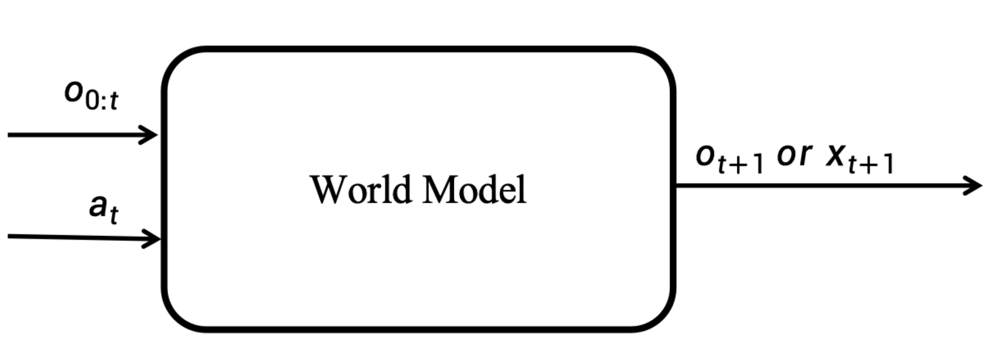
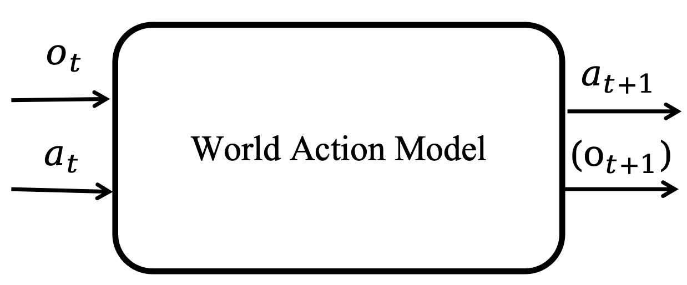
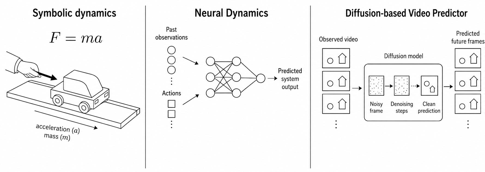
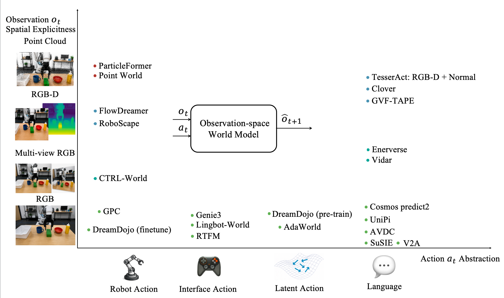
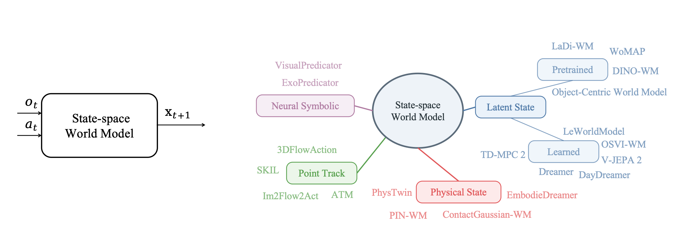
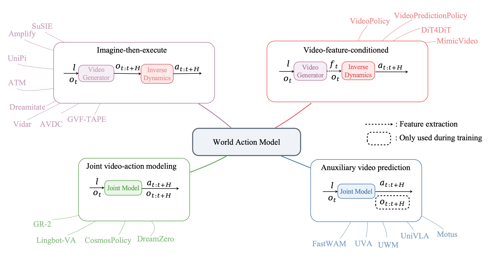

# 从世界模型到世界动作模型：面向机器人学的简明教程

**语言 / Language:** [English](https://github.com/clearlab-sustech/WorldModelSurvey/blob/main/README.md) | 中文

[**Xiaoxiong Zhang**](https://xiaoxiongzzzz.github.io/),
[**Xiong Zeng**](https://zengxiong111.github.io/zengxiong.github.io/) 和
[**Wei Zhang**](https://www.wzhanglab.site/)<br>
南方科技大学；LimX Dynamics

[项目主页](https://clearlab-sustech.github.io/WorldModelSurvey/) |
[ArXiv](https://arxiv.org/abs/2607.00836) |
[论文 PDF](https://arxiv.org/pdf/2607.00836) |
[资源浏览器](https://clearlab-sustech.github.io/WorldModelSurvey/#resources) |
[引用](https://clearlab-sustech.github.io/WorldModelSurvey/#citation)

本仓库托管论文配套网站与整理后的参考文献列表。本文不是追求穷尽式综述，而是以教程视角建立一个紧凑的架构图景：什么构成一个 world，物理 AI 任务要求策略完成什么，世界模型如何预测未来世界演化，以及世界动作模型如何将这些未来与可执行动作耦合起来。

## 架构视角

**世界（world）** 是任务相关实体的集合，包括机器人及其环境。**物理 AI 任务** 要求策略在满足任务约束的同时，将世界从初始状态驱动到目标集合。

<table>
  <tr>
    <td align="center"></td>
    <td align="center"></td>
    <td align="center"></td>
  </tr>
  <tr>
    <td align="center">World</td>
    <td align="center">物理 AI 任务</td>
    <td align="center">策略框架</td>
  </tr>
</table>

## 世界模型与世界动作模型

**世界模型** 预测未来观测或状态如何在候选动作下演化，通常以当前观测为条件。**世界动作模型** 是一类策略，其动作生成在训练或推理阶段与未来世界演化的模型或表示相耦合。

<table>
  <tr>
    <td align="center"></td>
    <td align="center"></td>
  </tr>
  <tr>
    <td align="center">世界模型</td>
    <td align="center">世界动作模型</td>
  </tr>
</table>

<p align="center">
  
</p>

## 设计空间

我们首先根据预测发生的空间组织世界模型：

- **观测空间世界模型**：直接预测未来观测，例如 RGB 图像、多视角 RGB、RGB-D 帧或点云。
- **状态空间世界模型**：先将观测抽象为结构化状态，再在状态空间中建模未来演化。

<table>
  <tr>
    <td align="center"></td>
    <td align="center"></td>
  </tr>
  <tr>
    <td align="center">观测空间世界模型</td>
    <td align="center">状态空间世界模型</td>
  </tr>
</table>

## 世界动作模型分类体系

世界动作模型将面向未来的视觉预测与物理决策耦合起来。本文将代表性方法归纳为四种范式：先想象再执行、视频特征条件动作预测、联合视频-动作建模，以及用于策略学习的辅助视频预测。

<p align="center">
  
</p>

## 资源浏览器

配套网站提供了一个与论文分类体系对齐的可筛选论文列表：

https://clearlab-sustech.github.io/WorldModelSurvey/#resources

## 引用

```bibtex
@article{zhang2026worldactionmodels,
  title   = {From World Models to World Action Models: A Concise Tutorial for Robotics},
  author  = {Zhang, Xiaoxiong and Zeng, Xiong and Zhang, Wei},
  year    = {2026},
  note    = {Survey manuscript}
}
```

## 联系

欢迎提出建议、补充遗漏论文、改进分类体系或参与讨论：

```text
12433017@mail.sustech.edu.cn
```
